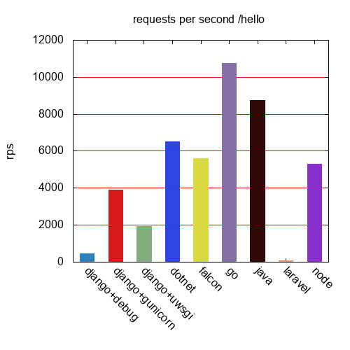
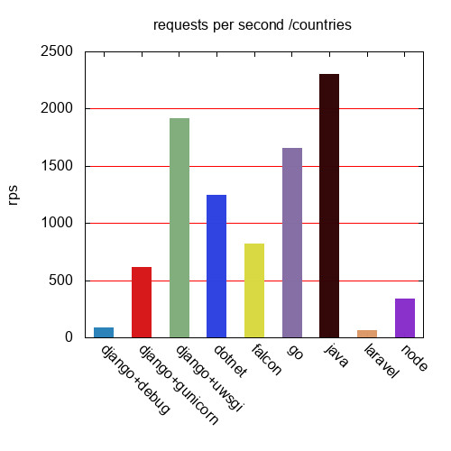
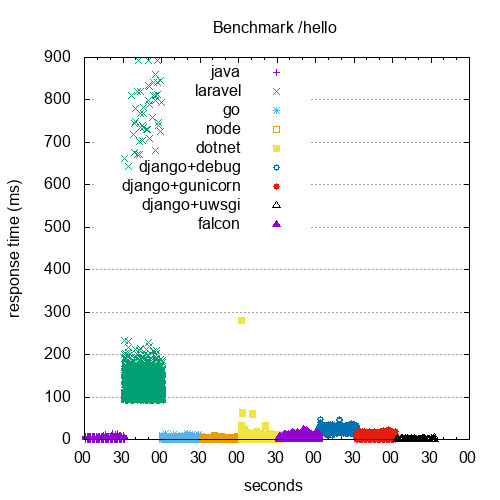
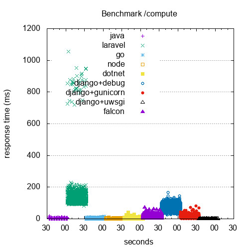
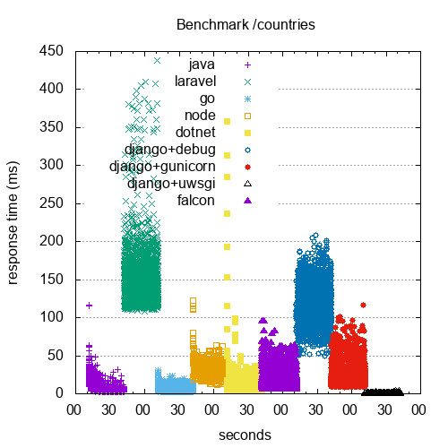

# web frameworks benchmark
This project was inspired by Mihai Cracan's article [Web REST API Benchmark on a Real Life Application](https://medium.com/@mihaigeorge.c/web-rest-api-benchmark-on-a-real-life-application-ebb743a5d7a3).
I was curious how Golang compare to other languages in terms of performance.

## Tested frameworks
* .NET core
* Golang mux
* Java Spring
* PHP Laravel
* Node express
* Python Django (with debug web server)
* Python Django (with gunicorn, 12 workers)

## App under test
Each app exposes the same 4 endpoints with different complexity:

* Hello World - simply respond with {"hello": "world"}.
* Computation - Compute first 10 000 Fibonacci numbers and respond with {"status": "done"}.
* Simple Listing - List all records from countries table.
* Complex Listing - List all users who visited France alongside with all visited countries. Users has many to many relationship with countries.

## Benchmark results
### Hello world requests per second

### Computation requests per second

### Simple listing requests per second

### Complex listing requests per second

### Hello world response time distribution

### Computation response time distribution

### Simple listing response time distribution

### Complex listing response time distribution

## Benchmark metodology
Benchmark was run on Google Cloud Platform n1-standard-4 instance with 4 vCPUs and 15GB RAM
All apps and MySQL database was running simultaneously in Docker containers bootstrapped with [docker-compose.yml](docker-compose.yml)
Apache Benchmark was run on separate instance. 

## How to run benchmark?
This repo contains several bash scripts to run benchmark. Scripts was tested on Ununtu 18.04 LTS.
1. Clone this repository.
2. Run `./up.sh` - This script will install docker, start mysql database, restore database dump from `database.sql` 
file, start all applications and run newman tests to ensure that everything is up and running.
3. Run `./ab.sh hostname` - This script will run Apache Benchmark against `hostname` and save results to `data` directory
4. To generate charts you need to have gnuplot installed and run `gnuplot timeseries.plt; gnuplot rps.plt` charts will be saved to `graphs` directory.
